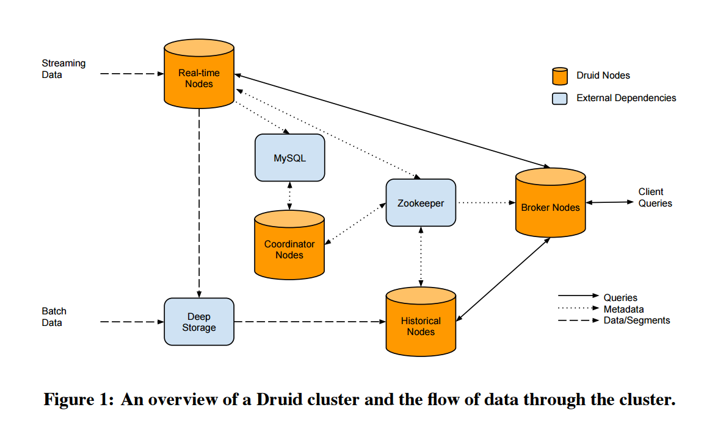

# Druid 架构

一个常见的 Druid 架构如下所示：

我们从图中可发现有两种类型的服务： Druid Nodes（黄色）以及外部依赖服务（蓝色）。

# 服务的概要说明

Zookeeper：提供分布式协调服务，比如发现 Druid 服务、下发任务等。

Realtime Nodes：负责接收并处理流数据、将数据存至 DeepStorage、提供实时数据查询等。

Deep Storage：存放 segment 等文件的地方，提供文件写入和读取服务，它属于外部依赖，可以通过拓展支持本地文件系统、HDFS、S3等多种存储方式。

Historical Nodes：接收执行 Coordinator 下发的 segment 加载/卸载任务、提供历史数据查询的服务。

Broker Nodes：直接和客户端交互（HTTP 接口），向外部提供 Druid 集群的查询代理服务。

MySQL（MetaStorage）：存放 Druid 集群的元数据，比如 segment、rule、task 等信息，可以替换为 Derby、Postgresql等数据库。

Coordinator Nodes：管理集群中 segment 的负载均衡和副本、应用 Rules 来管理 segment 的生命周期。

# 流程说明 （服务间如何协作）

结合架构图看，我们可以通过 Druid 的核心流程了解这些服务是如何协作的：

## 实时流数据写入

- 流数据首先由 Realtime Nodes 接收，接着被处理后将保存到 Deep Storage，之后 Historical Nodes 将从 Deep Storage 下载这些数据。
- Realtime Nodes 在处理流数据时，还将同时提供这些实时数据的查询服务给 Broker 。

## 批量数据写入

和实时流处理不同的地方在于采用离线批处理的方式把数据写入 Deep Storage，比如从 HDFS 文件读取数据。

## 客户端查询

客户端提交查询请求到 Broker，Broker 将解析请求，并从 Zookeeper 上获取 Realtime Nodes 和 Historical Nodes 的信息，接着发送查询请求给这些服务，最后将结果合并之后返回给客户端。

## segment 管理

- 首先 MySQL 中记录了 DataSource 和 segment 的信息，因此 Coordinator 可从 MySQL 获取到。之后由于 Historical 会将自身的信息注册在 Zookeeper ，那么 Coordinator 从 Zookeeper 获取到 Historical Nodes 的分布和状态后，即可通过 Zookeeper 对 Historical 下发 segment 加载或卸载请求，实现 segment 的负载均衡和多副本可用。
- Coordinator 还会通过配置的 rule （存储在 MySQL）对 segment 进行生命周期管理（哪些 segment 什么时候加载或清理等）。

# 更多

这里只是概要说明，只需了解集群中各个服务的作用和协作流程，更多的细节会在对应的章节上介绍。
